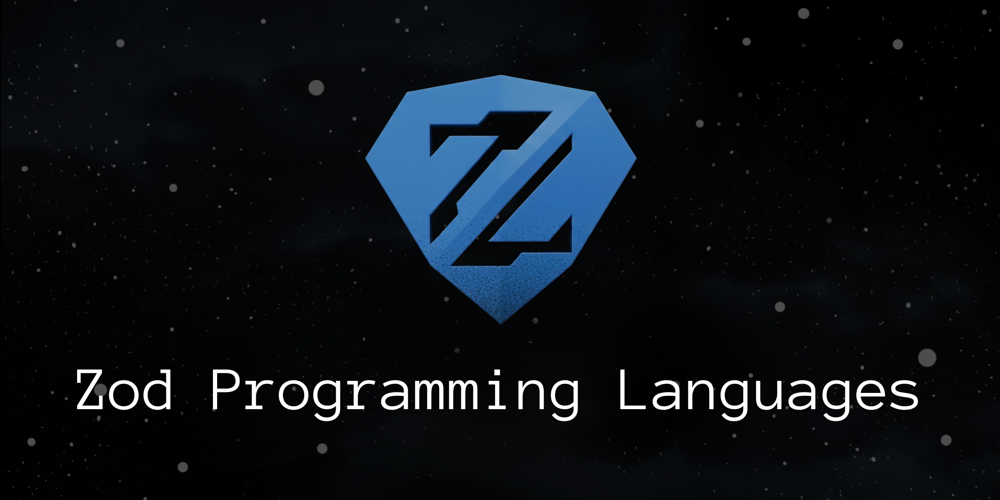

# Zod Programming Language

<p align="center">
    
</p>

Zod is a small, interpreted, dynamically typed with a first-class functions, closures, arrays, hashes, and more.

## Install

Prebuilt binaries for Linux, macOS, and Windows are attached to every [GitHub Release](https://github.com/theawakener0/Zod/releases).

### Option 1: Download script

```sh
curl -fsSL https://raw.githubusercontent.com/theawakener0/Zod/main/install.sh | sh
```

### Option 2: go install

```sh
go install github.com/theawakener0/Zod@latest
```

Requires [Go](https://go.dev/dl/) 1.22 or newer and installs the `Zod` executable into your Go bin directory.

### Option 3: Manual download

Grab the tarball for your OS/architecture from the [Releases page](https://github.com/theawakener0/Zod/releases), extract it, and put the `zod` binary on your `PATH`.

## Features

- First-class functions and closures
- Data types: integers, booleans, strings, arrays, hashes, and `null`
- `if` / `else if` / `else` control flow
- C-style `for` loops, and infinite `loop`
- `break` and `continue`
- Built-in functions for I/O (`println()`, `printf()`, `input()`, etc.), arrays, and hashes
- An interactive REPL 

## Getting Started

### Prerequisites

- [Go](https://go.dev/dl/) 1.22 or newer

### Build

```sh
go build -o zod .
# if you installed using the script or go install you can just run zod
```

### Run the REPL

```sh
./zod
```

Inside the REPL, type `/clear` to clear the screen and `/exit` to quit.

### Run a script

```sh
./zod file.zd
```

### Run the examples

```sh
./zod examples/hello.zd
./zod examples/guess_the_number.zd
```

## Examples

### Hello, World!

```zod
println("Hello, World!")
```

### Variables and data types

```zod
let name = "Zod"
version := 1
let isAwesome = true
 scores := [10, 20, 30]
let config = {"lang": "Zod", "year": 2026}
nothing := null
```

### Functions and closures

```zod
let add = fn(x, y) { x + y }
println(add(2, 3))  // 5

makeAdder := fn(x) {
    fn(y) { x + y }
}
let addFive = makeAdder(5)
println(addFive(10))  // 15
```

### Control flow

```zod
let grade = fn(score) {
    if (score >= 90) {
        "A"
    } elseif (score >= 80) {
        "B"
    } else {
        "C"
    }
}

println(grade(95))  // A
```

### Loops

```zod
// C-style for loop
for (i := 0; i < 5; i++) {
    println(i)  
/*
    0
    1
    2
    3
    4
*/
}

// While-style for loop
let x = 0
for (x < 3) { x++ }
println(x)  // 3

// Infinite loop with break / continue
let i = 0
loop {
    i++
    if (i == 3) { continue }
    if (i == 6) { break }
}
```

More runnable examples live in [`examples/`](examples/).

## Language Reference

### Data types

| Type      | Example                         |
| --------- | ------------------------------- |
| Integer   | `42`, `-7`, `0`                 |
| Boolean   | `true`, `false`                 |
| String    | `"Hello, World!"`               |
| Array     | `[1, 2, 3]`, `[]`               |
| Hash      | `{"name": "Zod"}`, `{}`         |
| Null      | `null`                          |

> [!NOTE]
> The Hash type is implemented as a Go map, so it's not a true Hashmap and does not preserve order.

### Operators

| Category      | Operators                                |
| ------------- | ---------------------------------------- |
| Arithmetic    | `+`  `-`  `*`  `/`                       |
| Comparison    | `==`  `!=`  `<`  `>`  `<=`  `>=`         |
| Logical       | `&&`  `\|\|`  `!`                        |
| Increment     | `++`  `--` (prefix and postfix)          |

### Assignment

| Operator | Meaning                                   |
| -------- | ----------------------------------------- |
| `let`    | Declare a new variable: `let x = 5`       |
| `:=`     | Assign (declares if needed): `x := 5`     |

Index assignment works on arrays and hashes too: `nums[0] = 10`, `user["age"] += 1`.

## Built-in Functions

| Function              | Description                                    |
| --------------------- | ---------------------------------------------- |
| `len(x)`              | Length of a string, array, or hash             |
| `println(...)`        | Print each argument on its own line            |
| `printf(fmt, ...)`    | Formatted output (Go-style verbs)              |
| `input(prompt)`       | Read a line of input from the user             |
| `int(x)`              | Convert a string/bool to an integer            |
| `string(x)`           | Convert an int/bool to a string                |
| `type(x)`             | Return the type name of `x`                    |
| `first(arr)`          | First element of an array                      |
| `last(arr)`           | Last element of an array                       |
| `push(arr, x)`        | New array with `x` appended                    |
| `pop(arr)`            | New array without its last element             |
| `insert(hash, k, v)`  | New hash with `k: v` added                     |
| `remove(hash, k)`     | New hash without key `k`                       |
| `keys(hash)`          | Array of keys in a hash                        |
| `vals(hash)`          | Array of values in a hash                      |
| `contains(hash, k)`   | Whether a hash contains key `k`                |
| `random(x)`           | Random integer between 0 and `x`               |
| `matrix(r, c, data)`  | Create a 2D array with `r` rows and `c` cols   |

> [!NOTE]
> The `matrix` function is still under development so don't expect to use it in real appliction. 

## Acknowledgments

Inspired by Thorsten Ball's *Writing an Interpreter in Go*.

## License

MIT License. See [`LICENSE`](LICENSE).
