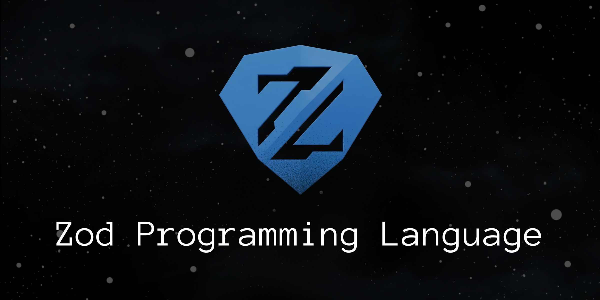

# Zod Programming Language

<p align="center">
    
</p>

Zod is a small, interpreted, dynamically typed with a first-class functions, closures, arrays, hashes, and more.

## Install

Prebuilt binaries for Linux, macOS, and Windows are attached to every [GitHub Release](https://github.com/theawakener0/Zod/releases).

### Option 1: Download script

```sh
curl -fsSL https://raw.githubusercontent.com/theawakener0/Zod/main/install.sh | sh
```

### Option 2: go install

```sh
go install github.com/theawakener0/Zod@latest
```

Requires [Go](https://go.dev/dl/) 1.22 or newer and installs the `Zod` executable into your Go bin directory.

## Demo

### Conway's Game of Life


## Features

- First-class functions and closures
- Data types: integers, floats, booleans, strings, arrays, hashes, matrices, and `null`
- `if` / `elseif` / `else` control flow
- C-style `for` loops, and infinite `loop`
- `break` and `continue`
- `try(expr)` for recoverable errors
- Built-in functions for I/O (`println()`, `printf()`, `input()`, etc.), arrays, and hashes
- An interactive REPL

## Getting Started

### Prerequisites

- [Go](https://go.dev/dl/) 1.22 or newer

### Build

```sh
# if you installed manually run this
go build -o zod .
```

### Run the REPL

```sh
# if you installed using the script
zod

# if you installed using go install
Zod
```

Inside the REPL, type `/clear` to clear the screen and `/exit` to quit.

### Run a script

```sh
# if you installed using the script
zod file.zd

# if you installed using go install
Zod file.zd
```

## Examples

### Hello, World!

```zod
println("Hello, World!")
```

More runnable examples live in [`examples/`](examples/).

## Language Reference

### Data types

| Type      | Example                         |
| --------- | ------------------------------- |
| Integer   | `42`, `-7`, `0`                 |
| Float     | `3.14`, `-0.5`, `20.0`          |
| Boolean   | `true`, `false`                 |
| String    | `"Hello, World!"`               |
| Array     | `[1, 2, 3]`, `[]`               |
| Hash      | `{"name": "Zod"}`, `{}`         |
| Matrix    | `matrix(2, 2, [1, 2, 3, 4])`    |
| Null      | `null`                          |

### Operators

| Category      | Operators                                |
| ------------- | ---------------------------------------- |
| Arithmetic    | `+`  `-`  `*`  `/`                       |
| Comparison    | `==`  `!=`  `<`  `>`  `<=`  `>=`         |
| Logical       | `&&`  `\|\|`  `!`                        |
| Increment     | `++`  `--` (prefix and postfix)          |

### Assignment

| Operator | Meaning                                   |
| -------- | ----------------------------------------- |
| `let`    | Declare a new variable: `let x = 5`       |
| `:=`     | Assign (declares if needed): `x := 5`     |

Index assignment works on arrays and hashes too: `nums[0] = 10`, `user["age"] += 1`.

## Built-in Functions

| Function              | Description                                    |
| --------------------- | ---------------------------------------------- |
| `len(x)`              | Length of a string, array, hash, or matrix     |
| `println(...)`        | Print each argument on its own line            |
| `printf(fmt, ...)`    | Formatted output (Go-style verbs)              |
| `input(prompt)`       | Read a line of input from the user             |
| `type(x)`             | Return the type name of `x`                    |
| `matrix(r, c, data)`  | Matrix with `r` rows and `c` cols from `data`  |
| `make(size) / make(size, value)` | Create a new array with `size` elements, and value |
| `color(color, text)`  | Change the color of `text` to `color`          |
| `sleep(ms)`           | Pause execution for `ms` milliseconds          |
| `exp(x)`              | e^x |
| `pi()`                | π |

> [!NOTE]
> The `color` function is still under development so it doesn't have many colors.

for more details. Go to the [docs](docs/introduction.md).

## Acknowledgments

Inspired by Thorsten Ball's *Writing an Interpreter in Go*.

## License

MIT License. See [`LICENSE`](LICENSE).
